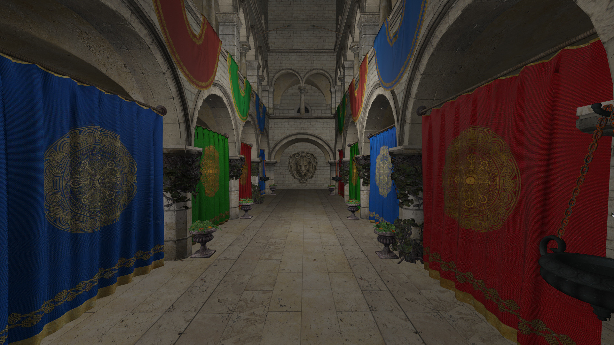

# walk-gltf - GLTF 2.0 model viewer #

## Introduction ##

walk-gtf is a viewer for GLTF 2.0 files. It is written in C++ and uses the Vulkan API for graphics and
SDL2 for windowing / input. It uses basic PBR shading.

## Building ##

Compiling this source code requires a C++20 compatible compiler and the development files for Vulkan, SDL2, tinygltf and json.hpp.

On Ubuntu 21.10 these can be installed with:

`sudo apt install build-essential libsdl2-dev nlohmann-json3-dev libtinygltf-dev libvulkan-dev vulkan-validationlayers-dev glslang-tools`

To build the source code, type:

`mkdir build && cd build && cmake -DCMAKE_BUILD_TYPE=Release .. && make -j4`

To install the program and its required files, type:

`make install`

To configure installation into an another prefix than the default, type (for example):

`cmake -DCMAKE_INSTALL_PREFIX=$HOME/opt`

## Usage ##

To view a gltf file, type:

`walk-gltf filename`

## Command line arguments ###

    -f           Full screen
    -b           Borderless window
    -g           Don't grab mouse
    -s [path]    Use a skybox from the given directory.
                 Uses the following filenames: px.jpg, nx.jpg, py.jpg, ny.jpg, pz.jpg, ng.jpg
    -l           Do not add extra lights
    -fps         Print FPS to stdout
    -n           Force flat shading
    -x           Deduplicate vertices
    -t           Do not load textures
    -h           Print this help

## Hotkeys ##

    w, a, s, d, r, f   - move around
    SHIFT (hold)       - faster movement
    +, -               - increase / decrease movement speed
    5 / KEYPAD 5       - toggle fly / walk
    7 / KEYPAD 7       - increase model scale
    1 / KEYPAD 1       - decrease model scale
    4 / KEYPAD 4       - reset model scale
    ESC                - quit

## Included software ##

This source code includes copies of the following libraries:

- stb_image.h [https://github.com/nothings/stb]
- vk_mem_alloc.h [https://github.com/GPUOpen-LibrariesAndSDKs/VulkanMemoryAllocator]

